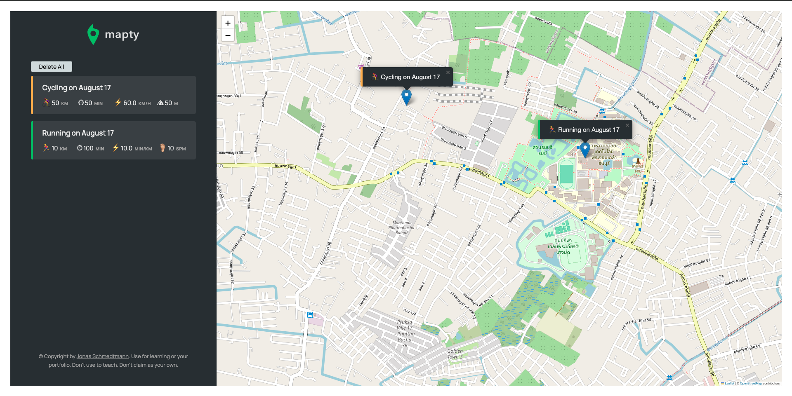

# Mapty Project

 

  
 
The Mapty project is a dynamic web application developed as part of Jonas Schmedtmann’s course. This project focuses on building a map-based fitness tracker that allows users to log their workouts and visualize their routes on a map. It demonstrates various web development concepts, including map integration, form handling, and local storage.

## Key Features

- **Interactive Map**: Integrates with the Leaflet library to display a map where users can track their workout routes.
- **Workout Logging**: Users can log different types of workouts (e.g., running, cycling) with details such as distance, duration, and pace.
- **User Interface**: Features a user-friendly interface for entering workout details and viewing logged workouts.
- **Local Storage**: Stores workout data locally in the browser, allowing users to view their history even after refreshing the page.
- **Custom Markers**: Uses custom markers to differentiate between different types of workouts on the map.

## Technologies Used

- **HTML/CSS**: For creating the structure and styling of the application.
- **JavaScript**: For implementing interactive features and managing application logic.
- **Leaflet**: A popular open-source JavaScript library for interactive maps.
- **Local Storage**: For saving workout data in the browser.
- **Geolocation API**: To get the user’s current location for starting new workouts.
- **ESLint**: For code quality and consistency.
- **Prettier**: For automatic code formatting.

## Flow Structure

 

## Learning Objectives

- **Map Integration**: Learn how to integrate and work with mapping libraries like Leaflet.
- **Form Handling**: Understand how to handle form inputs and validate user data.
- **Local Storage**: Gain experience with local storage to persist data across sessions.
- **Geolocation**: Learn to use the Geolocation API to get and use the user's current location.
- **State Management**: Manage the application's state to update the UI based on user interactions and stored data.

## Getting Started

1. **Clone the Repository**: 

    ```bash
    git clone https://github.com/yourusername/mapty-project.git
    ```

2. **Navigate to the Project Directory**: 

    ```bash
    cd Mapty
    ```

4. **Start the Development Server**: 

    ```bash
    npx live-server
    ```

5. **Open Your Browser**: Visit `http://localhost:3000` to view the app.

## Contributing

Contributions to the Mapty project are welcome! If you have suggestions or improvements, please create a pull request or open an issue.

For more details and to see the full course, check out Jonas Schmedtmann’s course on [Udemy](https://www.udemy.com/course/advanced-css-and-sass/).
